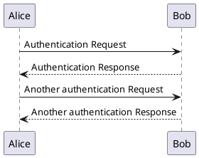

The UML (Unified Modeling Language) is a general-purpose, developmental,
modeling language in the field of software engineering that is intended to
provide a standard way to visualize the design of a system. This article is
a guide for us to learn this important tool in software engineering.

## Tools

There are many tools for implementing UML, here we choose PlantUML instead of
common drawing software. It uses a descriptive language to build models, which
has the following benefits:

- Focus on content rather than typography and style
- Plain text content, which can be versionlized
- Readable, intuitive, and low learning cost

## Models

- __Functional Model__: Shows the functionality of the system from the user's
  perspective, including use case diagrams.
- __Object model__: uses concepts such as objects, attributes, operations, and
  associations to display the structure and foundation of the system, including
  category diagrams and object diagrams.
- __Dynamic Model__: Shows the internal behavior of the system. Including sequence
  diagrams, activity diagrams, state diagrams.

## Diagrams

There are two main categories, `behavioral diagrams` and `structure diagrams`.
The following are the different UML Diagram Types:

- Behavioral Diagrams
  - __Sequence Diagram__
  - __Use Case Diagram__
  - __Activity Diagram__
  - __State Machine Diagram__
  - __Timing Diagram__
  - Communication Diagram
  - Interaction Overview Diagram
- Structure Diagrams
  - __Class Diagram__
  - __Object Diagram__
  - __Component Diagram__
  - __Deployment Diagram__
  - Package Diagram
  - Profile Diagram
  - Composite Structure Diagram

Note: The bold font of diagrams are supported by PlantUML.

## PlantUML Tutorial

Below are the supported `participant` in PlantUML:

- `actor`
- `boundary`
- `control`
- `entity`
- `database`
- `collections`
- `queue`

### Sequence Diagram

A __sequence diagram__ or __system sequence diagram (SSD)__ shows object
interactions arranged in time sequence in the field of software engineering.

A system sequence diagram should specify and show the following:

- __Actor__
- __Message__
- __Lifeline__
- __Activation__

In PlantUML:

- `->`: Arrow is used for delivery message
- `-->`: Dotted Arrow is used for return message

## References

- [Unified Modeling Language](https://www.wikiwand.com/en/Unified_Modeling_Language)
- [PlantUML Official Website](https://plantuml.com/)
- [The Unified Modeling Language Orgnization](https://www.uml-diagrams.org/)
